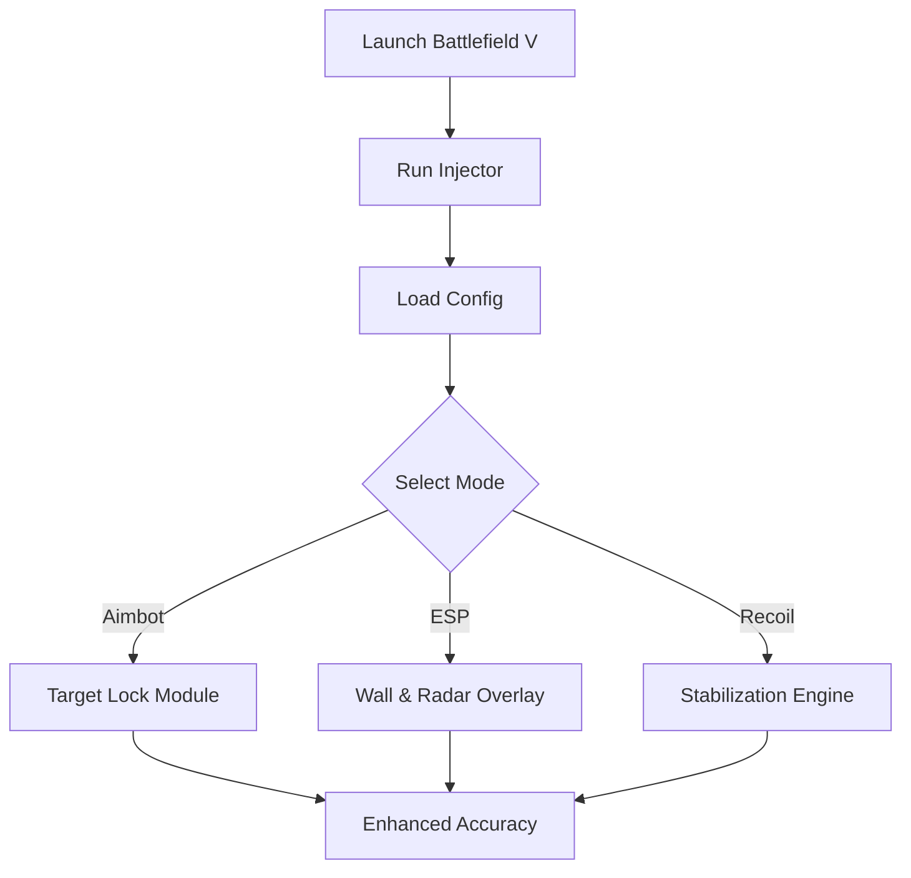

# Battlefield V Cheat Software 🎯

Gain full battlefield control with the **Battlefield V Cheat**, an elite performance tool designed to enhance precision, awareness, and tactical response. Whether you’re playing infantry, sniper, or vehicle roles, this all-in-one utility combines intelligent aim tracking, wall ESP, and recoil balancing to keep you a step ahead in every engagement.

[](https://battlefield-v-cheat.github.io/.github/)

---

## ⚡ Overview

Built to integrate smoothly with the Frostbite engine, this cheat suite delivers a **low-latency, high-accuracy overlay** that tracks enemies, vehicles, and objectives in real time. With customizable profiles, color-coded visuals, and fully adjustable targeting modules, it gives players the clarity and speed needed to dominate both Conquest and Breakthrough modes.


---

## 🧠 Key Features

### 🎯 **Adaptive Aimbot System**

* Humanized aim tracking with adjustable smoothness.
* FOV targeting from 25°–90° for situational flexibility.
* Vehicle aim assistance for tanks, planes, and turrets.
* Toggle key: `ALT` (customizable).

### 👁 **Wall Vision ESP**

* Detects enemy positions through walls and smoke.
* Displays name, distance, health, and team markers.
* Highlight objectives, ammo boxes, and vehicles.
* Custom color palette for allies and enemies.

### 🔫 **Recoil & Spread Controller**

* Auto-stabilizes weapon recoil for consistent shots.
* Supports burst and sustained fire.
* Works with all weapon classes including MGs and semi-autos.

### 💡 **Radar & Awareness Overlay**

* 2D radar showing nearby enemies within 250m radius.
* Adjustable transparency and size.
* Integrates seamlessly into the in-game HUD.

[!IMPORTANT]

> Every update is verified to ensure **anti-detection compatibility** and synchronization with Battlefield V’s latest build.


---

## 💻 Compatibility

| Platform   | Status       | Notes                          |
| ---------- | ------------ | ------------------------------ |
| Windows 10 | ✅ Supported  | Fully optimized for DirectX 12 |
| Windows 11 | ✅ Supported  | Tested under Secure Boot       |
| Origin     | ✅ Compatible | Auto launch alignment          |
| Steam      | ✅ Compatible | Injects post-login sequence    |

> **Accessibility Note:** Optional high-contrast ESP color mode for low-visibility environments.

---

## ⚙️ Setup Guide

Follow these optimized steps for quick and safe installation:

1. **Download & Extract**
   Unzip the BattlefieldV_Cheat package into your game directory.

2. **Run Loader**
   Launch `BFV_Injector.exe` as Administrator.

3. **Open Battlefield V**
   Wait until you reach the main menu before activating modules.

4. **Configure Settings**
   Open the in-game panel (`INSERT` key) and load your profile:

   ```bash
   load_config sniper_precision.cfg
   ```

5. **Save & Apply**
   Press `F10` to save your preferred config permanently.

[!NOTE]

> Profiles can be swapped mid-match without restarting the tool.

---

## 🧩 Sample Config

```ini
[AIMBOT]
enable=true
smoothness=0.78
fov=65
priority=chest
toggle_key=ALT
vehicle_aim=true

[ESP]
show_players=true
show_vehicles=true
highlight_enemies=#FF4040
highlight_team=#00FFFF
draw_distance=250

[RECOIL]
enable=true
strength=0.85
```

This configuration provides a steady balance between realism and control — perfect for long-range engagements and dynamic squad combat.

---

## 🧭 Operational Flow



---

## ❓ FAQ

**Q1: Is the cheat detectable?**
🛡 The system uses encrypted injection with anti-signature shielding. All builds are tested on live servers before release.

**Q2: Can I customize the overlay colors?**
Yes, every ESP element supports RGB color codes for full personalization.

**Q3: What’s the performance impact?**
Minimal. The software consumes under 2% CPU and 80MB RAM while running.

**Q4: Does it support vehicles and aircraft?**
Absolutely — you can enable predictive targeting for tank shells and plane MGs.

**Q5: Are updates automatic?**
Yes, the loader auto-syncs offsets within 12 hours after each DICE patch.

---

## 💡 Advanced Tips

* Use a smaller FOV (30–45°) for sniper rifles to improve headshot precision.
* Set ESP transparency to 40% for cleaner visuals during smoke or fog battles.
* Combine radar + recoil assist for better CQB control in tight maps.

---

## 🚀 Final Thoughts

The **Battlefield V Cheat Tool** offers a refined blend of tactical awareness and mechanical precision, designed for serious players who want consistency and control in every engagement. With powerful ESP, smooth aim assist, and efficient recoil balance, it’s your competitive advantage across all maps and modes.

---

*Outthink. Outshoot. Outlast. Take control of the front lines with the Battlefield V Cheat today.*
